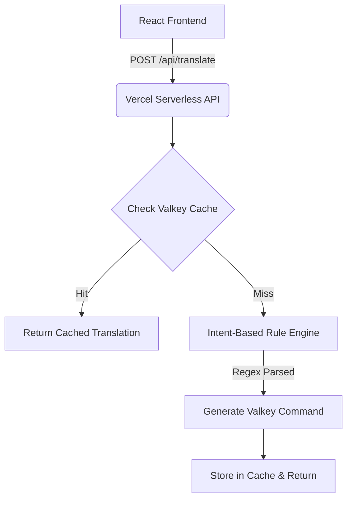

# SQL2Valkey

**Instantly map PostgreSQL queries to Valkey data structures.**


## 🎯 Problem Statement
Relational SQL developers often struggle to understand how to map their normalized table queries to high-performance, in-memory, key-value data structures like **Valkey** (a fork of Redis). **SQL2Valkey** acts as an interactive learning bridge. It translates common SQL queries into equivalent Valkey commands, explaining the precise data structure and architecture required to execute them natively.

## 🏗 Architecture
Our architecture eliminates heavy LLM dependencies in favor of an ultra-fast, local intent-based Rule Engine. It runs entirely on **Vercel Serverless Functions** with graceful fallbacks for a Valkey Cache layer.



## ✨ Features
- **Instant Translation**: Translates complex SQL operations (`SELECT`, `INSERT`, `UPDATE`, `DELETE`) into native Valkey equivalents (`HGETALL`, `HSET`, `DEL`).
- **Data Structure Explainers**: Educates the user on whether they need a Hash, List, Set, or Sorted Set to accomplish their SQL logic.
- **Graceful Fallbacks**: Smartly flags unsupported relational algebra (like `JOIN` and `GROUP BY`) and explains *why* Valkey doesn't support them out of the box.
- **Lightning Fast Caching**: Sub-millisecond response times for repeated queries powered by a local Valkey cache layer.

## 🛠 Tech Stack
- **Frontend**: React, Vite, Tailwind CSS
- **Backend API**: Vercel Serverless Functions (Node.js)
- **Storage/Cache**: Valkey (Optional via `ioredis` driver)
- **Engine**: Local Intent-Based Regex Parser

## 🚀 Setup Instructions

### 1. Prerequisites
- Node.js (v18+)
- Valkey Server (Optional for caching, running locally on port `6379`)

### 2. Install & Run
We use a unified frontend and serverless backend architecture.

```bash
cd frontend
npm install
npm run dev
```

The application will be running at `http://localhost:5173`, with API requests proxied automatically.

## 📸 Screenshots & Demo

### 🚀 Live Demo: **[https://sql2valkey.vercel.app](https://sql2valkey.vercel.app)**

Try entering the following queries in the live application:
- `SELECT * FROM users WHERE id=1` (Translates to `HGETALL`)
- `INSERT INTO users (name, age) VALUES ('Ali', 30)` (Translates to `HSET`)
- `SELECT users.name, orders.total FROM users JOIN orders ON users.id = orders.user_id` (Will show the graceful fallback explaining why JOINs are unsupported in Key-Value stores).

## 🔮 Future Improvements
1. **AI Integration**: Replace the static rule engine with a truly generative LLM to handle infinitely complex SQL edge-cases.
2. **Schema Analyzer**: Allow users to upload a `schema.sql` file and output a comprehensive Valkey database modeling schema.
3. **Execution Mode**: Actually execute the generated Valkey commands against a live test database.

---
*Built with ❤️ for the Build Beyond Limits Hackathon.*
